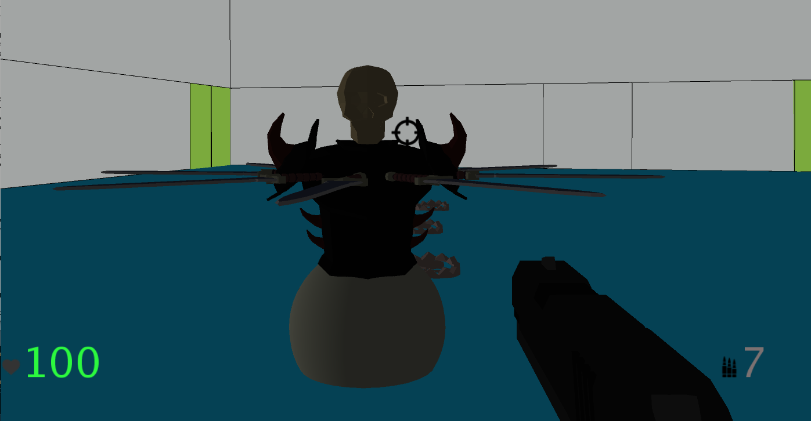
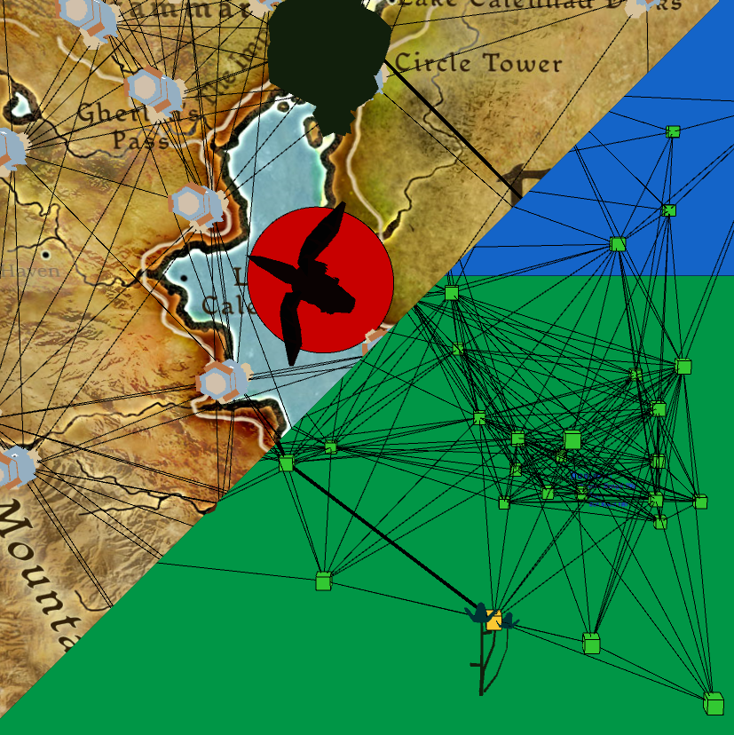
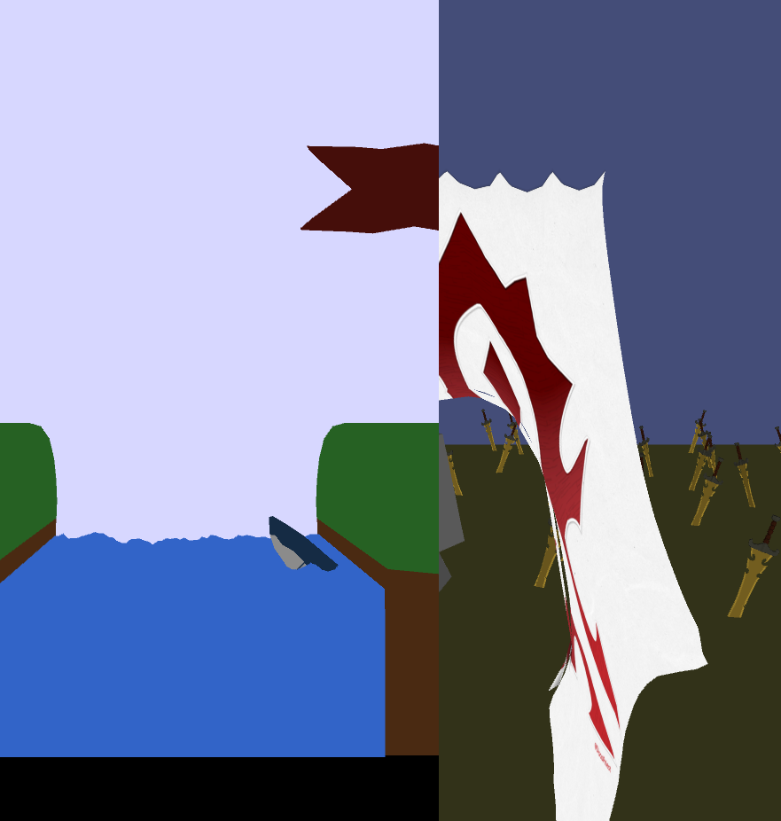
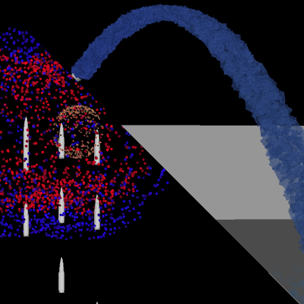

<link rel="stylesheet" type="text/css" href="style.css">

# Game Portfolio
## Unreal (C++)
will be ready in the future :)

## Processing (Java)

First Person Shooter

    

        
    

    

        
Path Planning

        
        
Physics Simulation

    

    

        
        
Particle Systems

    

